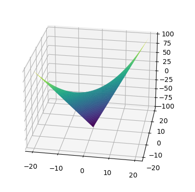
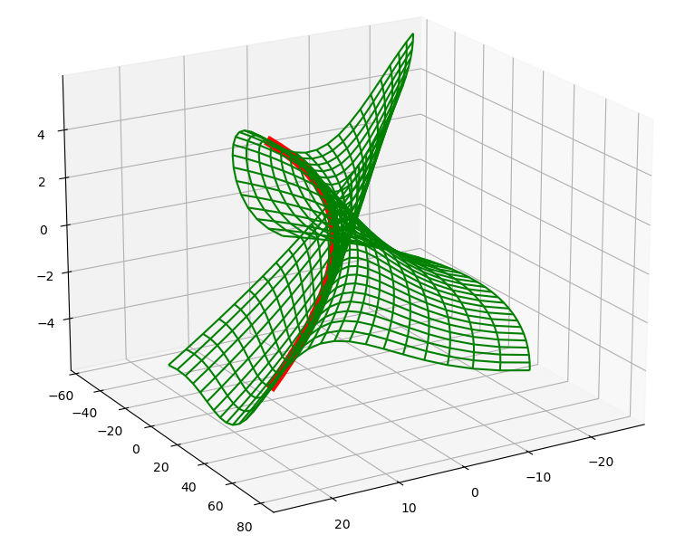
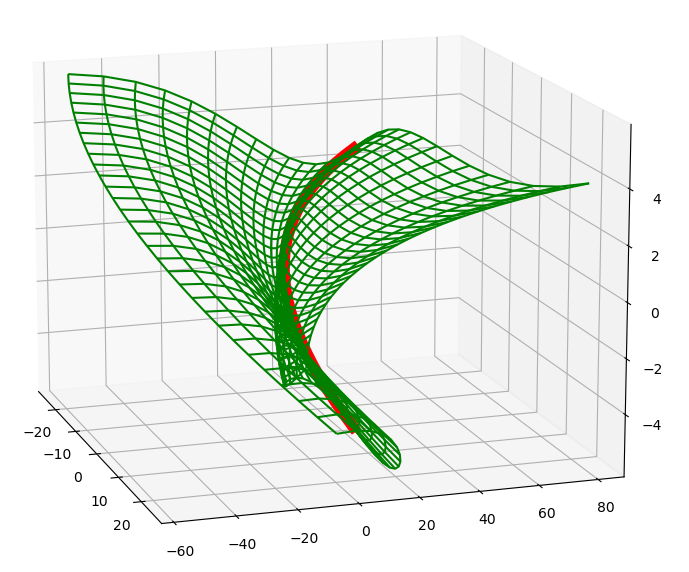
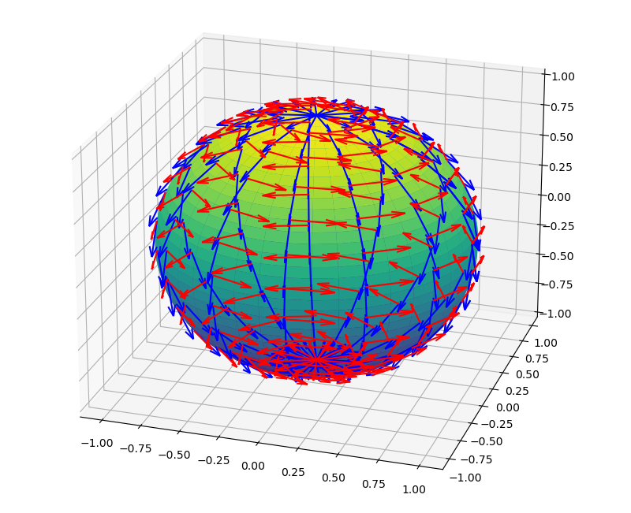
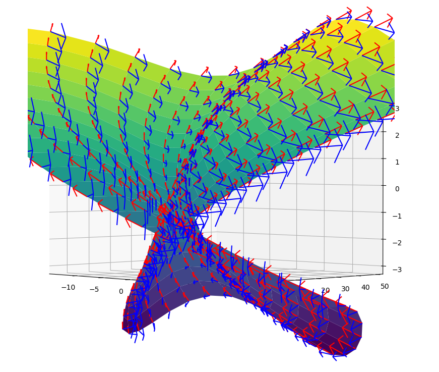

# Поверхности

## Желания:

1. Отрисовывать параметризованную 3d поверхность

## Вопросы:

1. Не понятен пункт 3 из определения регулярной поверхности:

вектора $$\frac{\partial r}{\partial u_1}, \frac{\partial r}{\partial u_2}, \dots$$ должны быть линейно независимы.

Окей, понятно, если один из векторов в какой-то точке равен нулю - это прямой аналог излома из кривых (лекция 1). И, как следстве, вектора будут линейно зависимы (т.к. система с нулевым вектором всегда линейно зависима -- у нулевого вектора можем поставить любое число, а у других - нули => нетривиальная сумма равна 0).

Непонятен случай, когда вектора коллинеарны, хочу найти подходящий пример и визуализировать. Как его найти?

Так, два вектора колинеарны, если их координаты пропорциональны. То есть, нужно найти такие dr/du1 и dr/du2, что dr/du1 = alpha * dr/du2. Будет ли это выполняться всегда или в какой-то точке?

Пример-1:
```
X = U + V
Y = U + V
Z = U * V
```
Во-первых, это будет плоская поверхность (без изгибов в пространстве). 

Почему?

По X, Y производные всегда равны 1, поэтому график не выходит из плоскости (a,a,Z), где a - любое число, Z - любое число. То есть, точка "не стримится вырваться" из этой плоскости.

При U = V, у нас будет график (2U, 2U, U^2) (или (2V, 2V, V^2)), вектора скоростей сонаправлены.



Интересно найти теперь пример, где поверхность не плоская, но есть особые места, где вектора скоростей колинеарны.

UPD (08.03.2026): придумал:

$$
x = \frac{u^2}{2} + u \cdot v - \frac{v^2}{2}
y = \frac{u^2}{2} + u \cdot v + \frac{v^3}{2}
z = u + sin(v)
$$

При $v = 0$, вектора $\frac{\partial r}{\partial u}$ и $\frac{\partial r}{\partial v}$ равны => получаем излом (или не излом? Хз, как это называется). На графике видно, как сетка начинает вытягиваться и превращаться в одномерную.

Красная линия - это часть графика при v = 0.

 


Так, ещё одна задача:
Для каждой точки поверхности нарисовать вектор скорости (по u и по v) - отрезок, исходащий от точки поверхности с длиной и направлением вектора скорости

Сделано:

Сфера:

Для предыдущего примера, где вектора становятся коллинеарными (но ненулевыми), можно заметить этот эффект:

Вектора красного цвета - скорости по u.
Вектора синего цвета - скорости по v. При v = 0, скорости становятся коллинеарными, сетка "схлопывается", получаем излом.

Что ещё хотелось бы сделать:

1. Движение точки и отрисовка векторов скоростей
2. Отрисовка касательной плоскости и нормали в точке.
3. Отрисовка координатных линий в точке (по u, v)
4. Переход к другой параметризации (?)
5. Анимация, доказывающая, что для каждой кривой, принадлежащей поверхности, и проходящей через точку, вектор скорости находится в одной и той же касательной плоскости (пусть, например, есть точка, и кривая в ней поворачивается)

## Конспект

У поверхностей есть 2 вида геометрии — **внутренняя** и **внешняя**.

**Внутренняя** — описывает то, что происходит "внутри" поверхностного мира (с точки зрения жителя этого мира). \
**Внешняя** — описывает поверхность со стороны наблюдателя (жителя пространства бОльшей размерности).

### Чуть более формальное описание:
Имеем евклидово пространство $\mathbb{R}^N$ размерности $N$.\
$M$ — это $n$-мерная поверхность в $\mathbb{R}^N$, $n < N$.

Координаты обозначаем как $x \in \mathbb{R}^N = \begin{pmatrix}
    x_1 \\
    \vdots \\
    x_n
\end{pmatrix} $

Многомерная поверхность в многомерном пространстве описывается по аналогии с кривыми: кривую определяем как траекторию движения точки в зависимости от одного параметра (следовательно, это траектория одномерная). \
В двумерном случае, у нас уже 2 направления, и мы, по аналогии, предполагаем, что двумерная поверхность задаётся двумя параметрами — когда меняем первый параметр, движемся в одном направлении, когда второй — в другом, и, в итоге, получаем поверхностью, описающую все возможные точки такого движения.

Если размерность поверхности = $n$, то она описывается $n$ параметрами.

Резюме:

Кривая — отображение отрезка $t$ в евклидово пространство, $t \mapsto \gamma(t)$. То есть, взяли отрезок, как-то его растянули, искривили, изогнули в нескольких направлениях, и получили кривую в многомерном пространстве

TODO: рисунок

Поверхность — аналогично, имеем какую-то область, растягиваем, искривляем её, и каждую её точку $u$ ($u = (u_1, \dots, u_n)$) отображаем в пространство: $u \mapsto r(u)$.

TODO: рисунок

### Формальное определение:

$n$-мерная гладкая элементарная регулярная поверхность $M$ в $\mathbb{R}^N$ — это множество $M \subset \mathbb{R}^N$, задаваемое параметрическими уравнениями вида:

$$x = r(u), \text{т.е.} \begin{pmatrix}
    x_1 = X_1(u) \\
    \vdots \\
    x_n = X_n(u)
\end{pmatrix}, u = (u_1, \dots, u_n), $$

где $X_i$ — это некоторая функция (наверное, удовлетворяющая каким-то условиям) от $u$, и задающая $i$ координату $N$-мерной точки $x$. (Например, $x_1 = x, x_2 = y, x_3 = z$, а $u = (u_1, v_1)$ или $(u, v)$).

