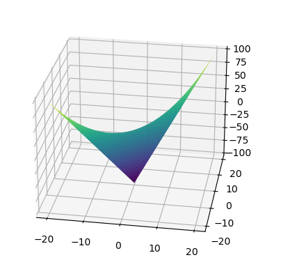
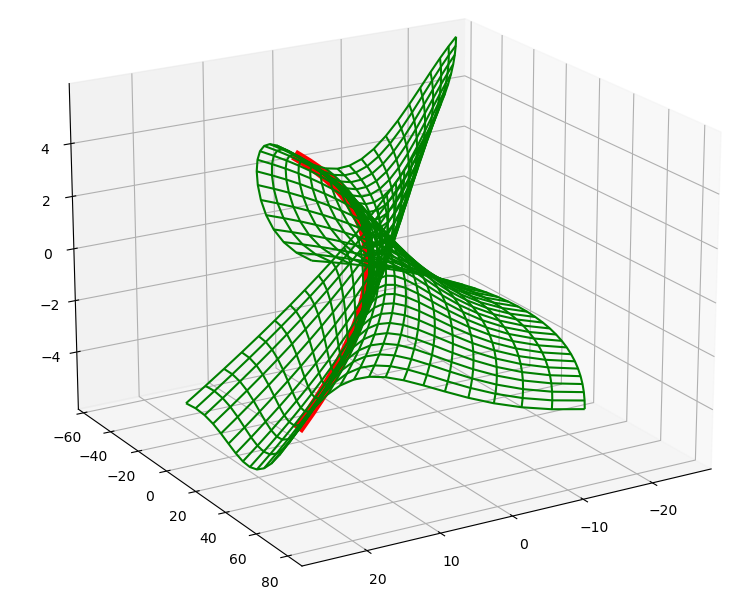
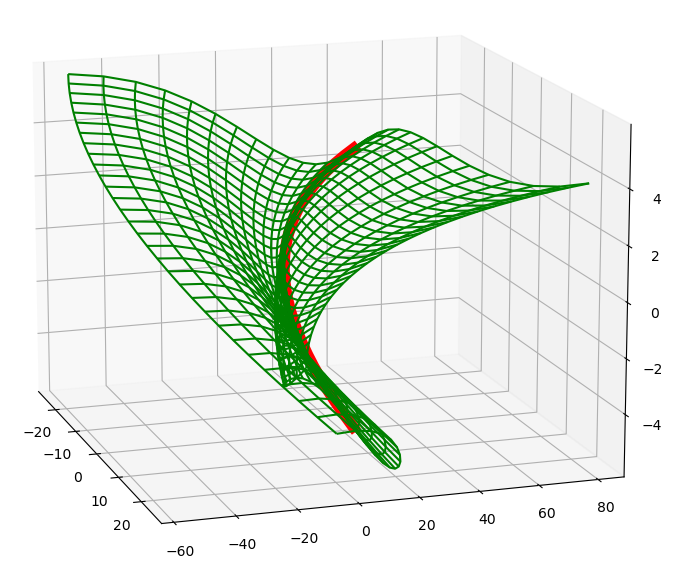
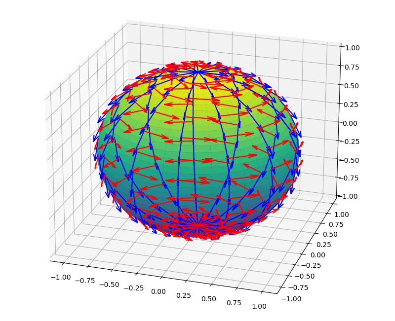
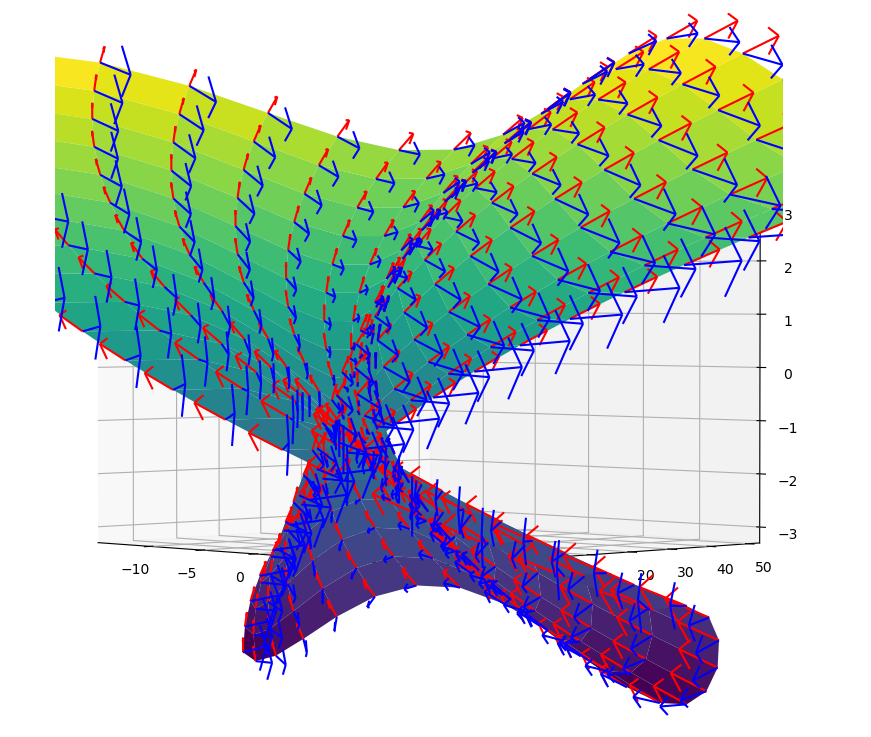
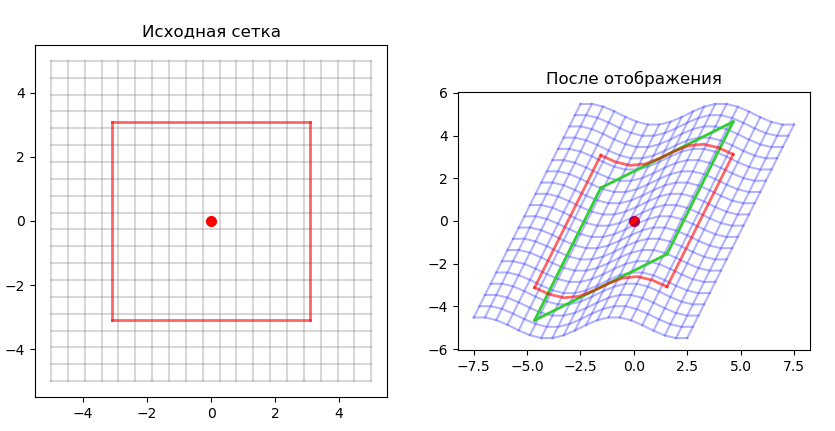
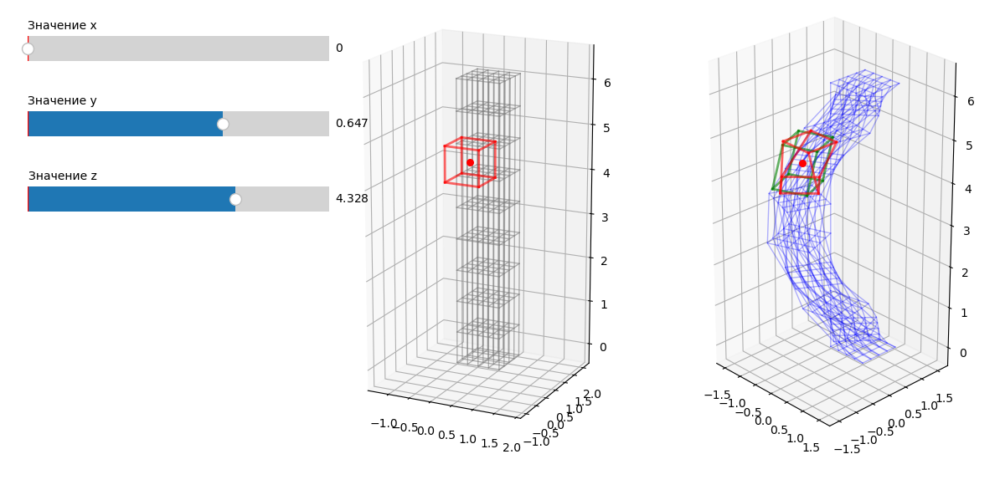

# Поверхности

## Желания:

1. Отрисовывать параметризованную 3d поверхность

## Вопросы:

1. Не понятен пункт 3 из определения регулярной поверхности:

вектора $$\frac{\partial r}{\partial u_1}, \frac{\partial r}{\partial u_2}, \dots$$ должны быть линейно независимы.

Окей, понятно, если один из векторов в какой-то точке равен нулю - это прямой аналог излома из кривых (лекция 1). И, как следстве, вектора будут линейно зависимы (т.к. система с нулевым вектором всегда линейно зависима -- у нулевого вектора можем поставить любое число, а у других - нули => нетривиальная сумма равна 0).

Непонятен случай, когда вектора коллинеарны, хочу найти подходящий пример и визуализировать. Как его найти?

Так, два вектора колинеарны, если их координаты пропорциональны. То есть, нужно найти такие dr/du1 и dr/du2, что dr/du1 = alpha * dr/du2. Будет ли это выполняться всегда или в какой-то точке?

Пример-1:
```
X = U + V
Y = U + V
Z = U * V
```
Во-первых, это будет плоская поверхность (без изгибов в пространстве). 

Почему?

По X, Y производные всегда равны 1, поэтому график не выходит из плоскости (a,a,Z), где a - любое число, Z - любое число. То есть, точка "не стримится вырваться" из этой плоскости.

При U = V, у нас будет график (2U, 2U, U^2) (или (2V, 2V, V^2)), вектора скоростей сонаправлены.



Интересно найти теперь пример, где поверхность не плоская, но есть особые места, где вектора скоростей колинеарны.

UPD (08.03.2026): придумал:

$$
x = \frac{u^2}{2} + u \cdot v - \frac{v^2}{2}
y = \frac{u^2}{2} + u \cdot v + \frac{v^3}{2}
z = u + sin(v)
$$

При $v = 0$, вектора $\frac{\partial r}{\partial u}$ и $\frac{\partial r}{\partial v}$ равны => получаем излом (или не излом? Хз, как это называется). На графике видно, как сетка начинает вытягиваться и превращаться в одномерную.

Красная линия - это часть графика при v = 0.

 


Так, ещё одна задача:
Для каждой точки поверхности нарисовать вектор скорости (по u и по v) - отрезок, исходащий от точки поверхности с длиной и направлением вектора скорости

Сделано:

Сфера:

Для предыдущего примера, где вектора становятся коллинеарными (но ненулевыми), можно заметить этот эффект:

Вектора красного цвета - скорости по u.
Вектора синего цвета - скорости по v. При v = 0, скорости становятся коллинеарными, сетка "схлопывается", получаем излом.

Что ещё хотелось бы сделать:

1. Движение точки и отрисовка векторов скоростей (✅ в `velocities-2.py`)
2. Отрисовка координатных линий в точке (по u, v) (✅ в `velocities-2.py`)
3. Отрисовка касательной плоскости и нормали в точке.
4. Переход к другой параметризации (?)
5. Анимация, показывающая, что для каждой кривой, принадлежащей поверхности, и проходящей через точку, вектор скорости находится в одной и той же касательной плоскости (пусть, например, есть точка, и кривая в ней поворачивается)

## Конспект

У поверхностей есть 2 вида геометрии — **внутренняя** и **внешняя**.

**Внутренняя** — описывает то, что происходит "внутри" поверхностного мира (с точки зрения жителя этого мира). \
**Внешняя** — описывает поверхность со стороны наблюдателя (жителя пространства бОльшей размерности).

### Чуть более формальное описание:
Имеем евклидово пространство $\mathbb{R}^N$ размерности $N$.\
$M$ — это $n$-мерная поверхность в $\mathbb{R}^N$, $n < N$.

Координаты обозначаем как $x \in \mathbb{R}^N = \begin{pmatrix}
    x_1 \\
    \vdots \\
    x_n
\end{pmatrix} $

Многомерная поверхность в многомерном пространстве описывается по аналогии с кривыми: кривую определяем как траекторию движения точки в зависимости от одного параметра (следовательно, это траектория одномерная). \
В двумерном случае, у нас уже 2 направления, и мы, по аналогии, предполагаем, что двумерная поверхность задаётся двумя параметрами — когда меняем первый параметр, движемся в одном направлении, когда второй — в другом, и, в итоге, получаем поверхностью, описающую все возможные точки такого движения.

Если размерность поверхности = $n$, то она описывается $n$ параметрами.

Резюме:

Кривая — отображение отрезка $t$ в евклидово пространство, $t \mapsto \gamma(t)$. То есть, взяли отрезок, как-то его растянули, искривили, изогнули в нескольких направлениях, и получили кривую в многомерном пространстве

TODO: рисунок

Поверхность — аналогично, имеем какую-то область, растягиваем, искривляем её, и каждую её точку $u$ ($u = (u_1, \dots, u_n)$) отображаем в пространство: $u \mapsto r(u)$.

TODO: рисунок

### Формальное определение:

$n$-мерная гладкая элементарная регулярная поверхность $M$ в $\mathbb{R}^N$ — это множество $M \subset \mathbb{R}^N$, задаваемое параметрическими уравнениями вида:

$$x = r(u), \text{т.е.} \begin{pmatrix}
    x_1 = X_1(u) \\
    \vdots \\
    x_n = X_n(u)
\end{pmatrix}, u = (u_1, \dots, u_n), $$

где $X_i$ — это некоторая функция (наверное, удовлетворяющая каким-то условиям) от $u$, и задающая $i$ координату $N$-мерной точки $x$. (Например, $x_1 = x, x_2 = y, x_3 = z$, а $u = (u_1, v_1)$ или $(u, v)$).

## TODO: отступление про производные 

## Матрица Якоби

Пусть задано отображение $u: \mathbb{R}^n \rightarrow \mathbb{R}^m$ 

$$u = \begin{pmatrix}
    u_1 \\
    \vdots \\
    u_m
\end{pmatrix}, u_i = u_i(x_1, \dots, x_n) $$

То есть, $u_i$ — это отображение $n$-мерной точки $x=(x_1, \dots, x_n)$ в $i$-тую координату $m$-мерной точки.

И пусть в точки $x$ имеются все частные производные первого порядка.

Матрица $J$, составленная из частных производных этих функций в точке $x$, называется матрицей Якоби данной системы функций:

$$J(x)= \begin{pmatrix}
    \frac{\partial u_1}{\partial x_1}(x) & \frac{\partial u_1}{\partial x_2}(x) & \dots & \frac{\partial u_1}{\partial x_n}(x) \\
    \frac{\partial u_2}{\partial x_1}(x) & \frac{\partial u_2}{\partial x_2}(x) & \dots & \frac{\partial u_2}{\partial x_n}(x) \\
    \vdots & \vdots & \ddots & \vdots \\
    \frac{\partial u_m}{\partial x_1}(x) & \frac{\partial u_m}{\partial x_2}(x) & \dots & \frac{\partial u_m}{\partial x_n}(x)
\end{pmatrix}$$

Что такое компонент $\frac{\partial u_i}{\partial x_j}(x)$? Это то, насколько изменение $j$-й координаты точки $x$ в исходном пространстве влияет (линейно) на изменение $i$-й координаты точки, полученной в результате применения отображения $u$ к этой точке $x$.

То есть, зная правило $u$, по которому каждой точке $x$ исходного пространства $\mathbb{R}^n$ ставится в соответствие точка результирующего пространства $\mathbb{R}^m$, мы можем определить специальный объект $J(x)$, который попарно связывает координаты $\mathbb{R}^n$ и $\mathbb{R}^m$, и такая связь содержит информацию о линейной зависимости между соответствующими координатами, которая возникает при применении $u$ в точке $x$.

Частный случай — отображение из $\mathbb{R}^n$ в $\mathbb{R}^n$. В таком случае матрица Якоби является квадратной. 

Вопросы: 
1. Применение матрицы к базисным векторам? Умножение матриц?
2. Как связано отображение с ортонормированностью базиса? Идет ли здесь вообще речь об ортонормированности?
3. Как это всё связано с векторными пространствами, квадратичными формами, евклидовостью пространства? 
4. Как дифференциальная геометрия связана с векторными полями?

#### Дивергенция

В случае отображения $\mathbb{R}^n \rightarrow \mathbb{R}^n$, матрица Якоби является квадратной, и по ней можно определить некоторую дополнительную информаци об отображении (наверное, в случае других видов отображений, тоже можно получить, пока хз как).

В частности, можно определить **дивергенцию**.

**Дивергенция** (от лат. divergere — расходиться) — это скалярный линейный дифференциальный оператор первого порядка, который характеризует «расходимость» или «сходимость» векторного поля в каждой отдельной точке пространства.

Как она определяется:


#### Ротор

### Пример линейного приближения с помощью матрицы Якоби.

#### Двумерный случай

Вокруг точки рисуем квадрат $[-eps, eps] \times [-eps, eps]$ и преобразуем его с помощью отображения, а также линейно приближаем с помощью матрицы Якоби.

Красный цвет — квадрат при применении отображения, зелёный — линейное приближение отображения квадрата.



#### Трёхмерный случай

Вокруг точки рисуем куб $[-eps, eps] \times [-eps, eps] \times  [-eps, eps]$ и преобразуем его с помощью отображения, а также линейно приближаем с помощью матрицы Якоби.

Красный цвет — куб при применении отображения, зелёный — куб при линейном приближении.



При линейном приближении получаем параллелепипед, в котором каждая грань параллельна противоположной, 
однако при отображении какие-то грани могут сворачиваться, искажаться.

Вопросы:
1. Почему матрица действует именно так? Почему приближает линейно, почему получаем именно параллелепипед, без свёрток, скосов и т.п.?

Ответ: а, ну потому что матрицу Якоби мы считаем для точки, вокруг которой строим куб, и эту одну и ту же матрицу мы применяем к каждой из точек куба. Действие матрицы зависит не от точки куба, а от точки, вокруг которой строим куб. 

Матрица искажает пространство линейно, что соответствует растяжениям, сжатиям, отражениям всего пространства (в частности, точек куба).

2. Как связана матрица Якоби с градиентами? Почему столбцы — это градиенты? Просто по определению?
3. Определитель и след матрицы Якоби, почему имеют такие свойства? Из чего это следует?
4. Как работают элементы матрицы Якоби? Растяжение/сжатие/поворот. 
5. Почему дивергенция и ротор определяются именно так?

Ответ:

## Касательные к поверхностям


