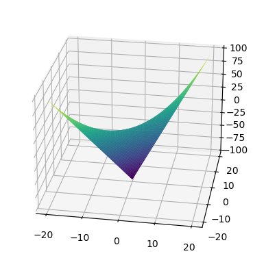
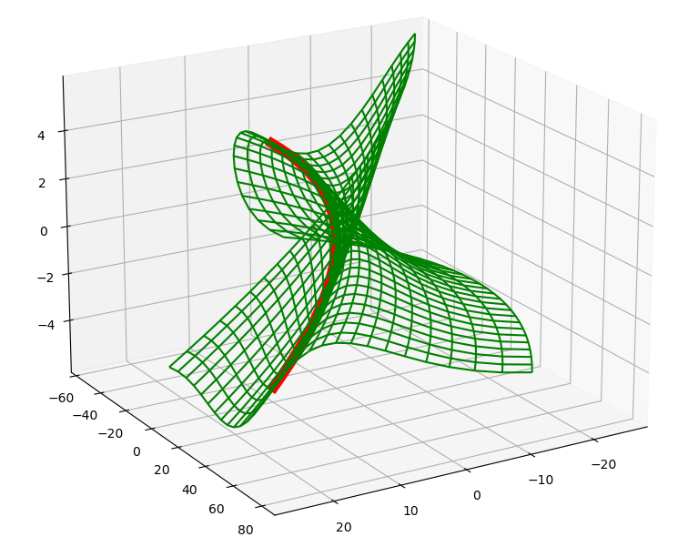
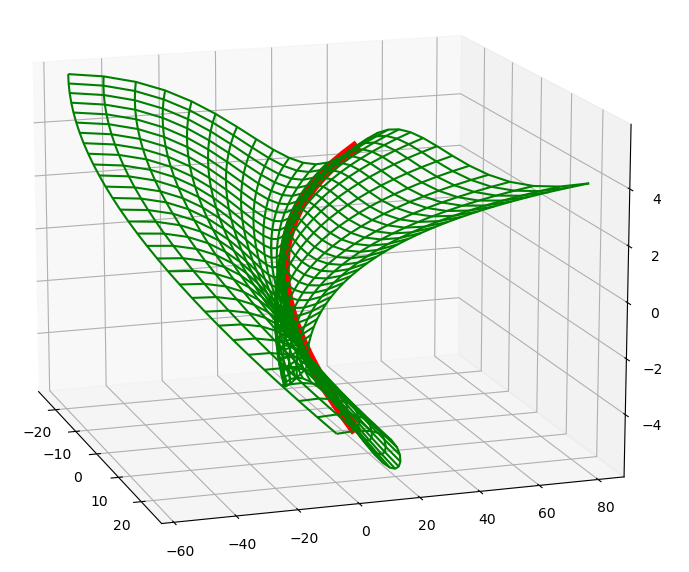
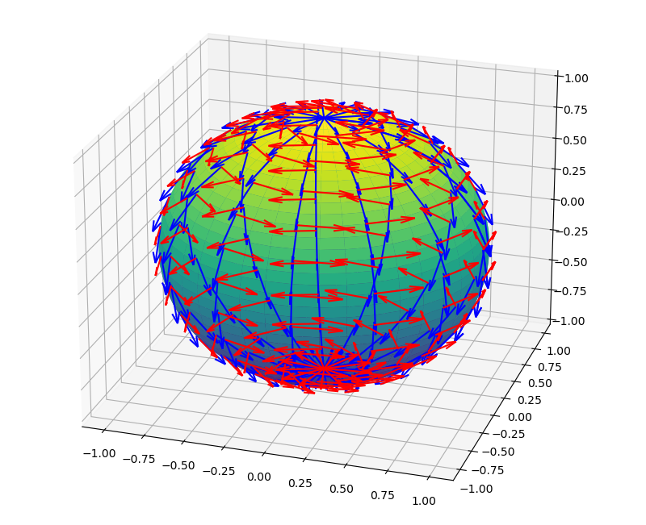
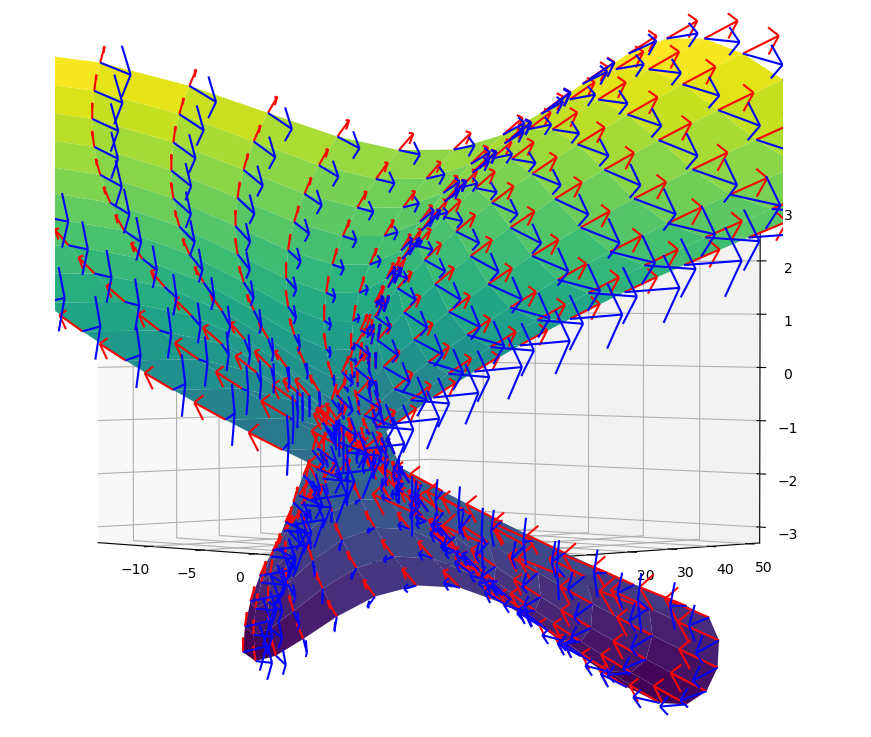
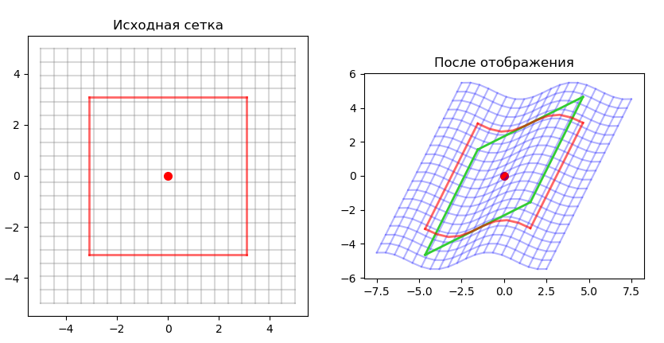
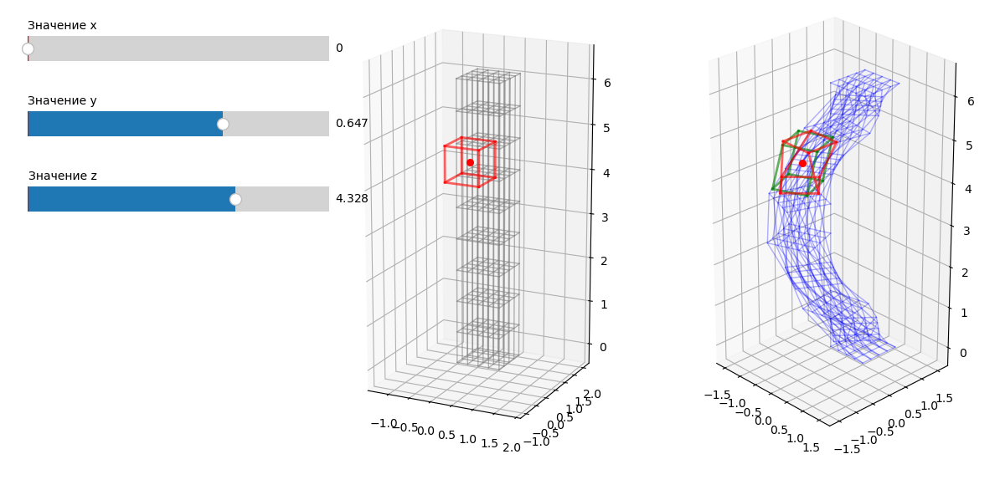

# Поверхности

## Желания:

1. Отрисовывать параметризованную 3d поверхность

## Вопросы:

1. Не понятен пункт 3 из определения регулярной поверхности:

вектора $$\frac{\partial r}{\partial u_1}, \frac{\partial r}{\partial u_2}, \dots$$ должны быть линейно независимы.

Окей, понятно, если один из векторов в какой-то точке равен нулю - это прямой аналог излома из кривых (лекция 1). И, как следстве, вектора будут линейно зависимы (т.к. система с нулевым вектором всегда линейно зависима -- у нулевого вектора можем поставить любое число, а у других - нули => нетривиальная сумма равна 0).

Непонятен случай, когда вектора коллинеарны, хочу найти подходящий пример и визуализировать. Как его найти?

Так, два вектора колинеарны, если их координаты пропорциональны. То есть, нужно найти такие dr/du1 и dr/du2, что dr/du1 = alpha * dr/du2. Будет ли это выполняться всегда или в какой-то точке?

Пример-1:
```
X = U + V
Y = U + V
Z = U * V
```
Во-первых, это будет плоская поверхность (без изгибов в пространстве). 

Почему?

По X, Y производные всегда равны 1, поэтому график не выходит из плоскости (a,a,Z), где a - любое число, Z - любое число. То есть, точка "не стримится вырваться" из этой плоскости.

При U = V, у нас будет график (2U, 2U, U^2) (или (2V, 2V, V^2)), вектора скоростей сонаправлены.



Интересно найти теперь пример, где поверхность не плоская, но есть особые места, где вектора скоростей колинеарны.

UPD (08.03.2026): придумал:

$$
x = \frac{u^2}{2} + u \cdot v - \frac{v^2}{2}
y = \frac{u^2}{2} + u \cdot v + \frac{v^3}{2}
z = u + sin(v)
$$

При $v = 0$, вектора $\frac{\partial r}{\partial u}$ и $\frac{\partial r}{\partial v}$ равны => получаем излом (или не излом? Хз, как это называется). На графике видно, как сетка начинает вытягиваться и превращаться в одномерную.

Красная линия - это часть графика при v = 0.

 


Так, ещё одна задача:
Для каждой точки поверхности нарисовать вектор скорости (по u и по v) - отрезок, исходащий от точки поверхности с длиной и направлением вектора скорости

Сделано:

Сфера:

Для предыдущего примера, где вектора становятся коллинеарными (но ненулевыми), можно заметить этот эффект:

Вектора красного цвета - скорости по u.
Вектора синего цвета - скорости по v. При v = 0, скорости становятся коллинеарными, сетка "схлопывается", получаем излом.

Что ещё хотелось бы сделать:

1. Движение точки и отрисовка векторов скоростей (✅ в `velocities-2.py`)
2. Отрисовка координатных линий в точке (по u, v) (✅ в `velocities-2.py`)
3. Отрисовка касательной плоскости и нормали в точке.
4. Переход к другой параметризации (?)
5. Анимация, показывающая, что для каждой кривой, принадлежащей поверхности, и проходящей через точку, вектор скорости находится в одной и той же касательной плоскости (пусть, например, есть точка, и кривая в ней поворачивается)

## Конспект

У поверхностей есть 2 вида геометрии — **внутренняя** и **внешняя**.

**Внутренняя** — описывает то, что происходит "внутри" поверхностного мира (с точки зрения жителя этого мира). \
**Внешняя** — описывает поверхность со стороны наблюдателя (жителя пространства бОльшей размерности).

### Чуть более формальное описание:
Имеем евклидово пространство $\mathbb{R}^N$ размерности $N$.\
$M$ — это $n$-мерная поверхность в $\mathbb{R}^N$, $n < N$.

Координаты обозначаем как $x \in \mathbb{R}^N = \begin{pmatrix}
    x_1 \\
    \vdots \\
    x_n
\end{pmatrix} $

Многомерная поверхность в многомерном пространстве описывается по аналогии с кривыми: кривую определяем как траекторию движения точки в зависимости от одного параметра (следовательно, это траектория одномерная). \
В двумерном случае, у нас уже 2 направления, и мы, по аналогии, предполагаем, что двумерная поверхность задаётся двумя параметрами — когда меняем первый параметр, движемся в одном направлении, когда второй — в другом, и, в итоге, получаем поверхностью, описающую все возможные точки такого движения.

Если размерность поверхности = $n$, то она описывается $n$ параметрами.

Резюме:

Кривая — отображение отрезка $t$ в евклидово пространство, $t \mapsto \gamma(t)$. То есть, взяли отрезок, как-то его растянули, искривили, изогнули в нескольких направлениях, и получили кривую в многомерном пространстве

TODO: рисунок

Поверхность — аналогично, имеем какую-то область, растягиваем, искривляем её, и каждую её точку $u$ ($u = (u_1, \dots, u_n)$) отображаем в пространство: $u \mapsto r(u)$.

TODO: рисунок

### Формальное определение:

$n$-мерная гладкая элементарная регулярная поверхность $M$ в $\mathbb{R}^N$ — это множество $M \subset \mathbb{R}^N$, задаваемое параметрическими уравнениями вида:

$$x = r(u), \text{т.е.} \begin{pmatrix}
    x_1 = X_1(u) \\
    \vdots \\
    x_n = X_n(u)
\end{pmatrix}, u = (u_1, \dots, u_n), $$

где $X_i$ — это некоторая функция (наверное, удовлетворяющая каким-то условиям) от $u$, и задающая $i$ координату $N$-мерной точки $x$. (Например, $x_1 = x, x_2 = y, x_3 = z$, а $u = (u_1, v_1)$ или $(u, v)$).

## TODO: отступление про производные 

## Матрица Якоби

Пусть задано отображение $u: \mathbb{R}^n \rightarrow \mathbb{R}^m$ 

$$u = \begin{pmatrix}
    u_1 \\
    \vdots \\
    u_m
\end{pmatrix}, u_i = u_i(x_1, \dots, x_n) $$

То есть, $u_i$ — это отображение $n$-мерной точки $x=(x_1, \dots, x_n)$ в $i$-тую координату $m$-мерной точки.

И пусть в точки $x$ имеются все частные производные первого порядка.

Матрица $J$, составленная из частных производных этих функций в точке $x$, называется матрицей Якоби данной системы функций:

$$J(x)= \begin{pmatrix}
    \frac{\partial u_1}{\partial x_1}(x) & \frac{\partial u_1}{\partial x_2}(x) & \dots & \frac{\partial u_1}{\partial x_n}(x) \\
    \frac{\partial u_2}{\partial x_1}(x) & \frac{\partial u_2}{\partial x_2}(x) & \dots & \frac{\partial u_2}{\partial x_n}(x) \\
    \vdots & \vdots & \ddots & \vdots \\
    \frac{\partial u_m}{\partial x_1}(x) & \frac{\partial u_m}{\partial x_2}(x) & \dots & \frac{\partial u_m}{\partial x_n}(x)
\end{pmatrix}$$

Что такое компонент $\frac{\partial u_i}{\partial x_j}(x)$? Это то, насколько изменение $j$-й координаты точки $x$ в исходном пространстве влияет (линейно) на изменение $i$-й координаты точки, полученной в результате применения отображения $u$ к этой точке $x$.

То есть, зная правило $u$, по которому каждой точке $x$ исходного пространства $\mathbb{R}^n$ ставится в соответствие точка результирующего пространства $\mathbb{R}^m$, мы можем определить специальный объект $J(x)$, который попарно связывает координаты $\mathbb{R}^n$ и $\mathbb{R}^m$, и такая связь содержит информацию о линейной зависимости между соответствующими координатами, которая возникает при применении $u$ в точке $x$.

Частный случай — отображение из $\mathbb{R}^n$ в $\mathbb{R}^n$. В таком случае матрица Якоби является квадратной. 

Вопросы: 
1. Применение матрицы к базисным векторам? Умножение матриц?
2. Как связано отображение с ортонормированностью базиса? Идет ли здесь вообще речь об ортонормированности?
3. Как это всё связано с векторными пространствами, квадратичными формами, евклидовостью пространства? 
4. Как дифференциальная геометрия связана с векторными полями?

#### Дивергенция

В случае отображения $\mathbb{R}^n \rightarrow \mathbb{R}^n$, матрица Якоби является квадратной, и по ней можно определить некоторую дополнительную информаци об отображении (наверное, в случае других видов отображений, тоже можно получить, пока хз как).

В частности, можно определить **дивергенцию**.

**Дивергенция** (от лат. divergere — расходиться) — это скалярный линейный дифференциальный оператор первого порядка, который характеризует «расходимость» или «сходимость» векторного поля в каждой отдельной точке пространства.

Как она определяется:


#### Ротор

### Пример линейного приближения с помощью матрицы Якоби.

#### Двумерный случай

Вокруг точки рисуем квадрат $[-\epsilon, \epsilon] \times [-\epsilon, \epsilon]$ и преобразуем его с помощью отображения, а также линейно приближаем с помощью матрицы Якоби.

Красный цвет — квадрат при применении отображения, зелёный — линейное приближение отображения квадрата.



#### Трёхмерный случай

Вокруг точки рисуем куб $[-\epsilon, \epsilon] \times [-\epsilon, \epsilon] \times  [-\epsilon, \epsilon]$ и преобразуем его с помощью отображения, а также линейно приближаем с помощью матрицы Якоби.

Красный цвет — куб при применении отображения, зелёный — куб при линейном приближении.



При линейном приближении получаем параллелепипед, в котором каждая грань параллельна противоположной, 
однако при отображении какие-то грани могут сворачиваться, искажаться.

Вопросы:
1. Почему матрица действует именно так? Почему приближает линейно, почему получаем именно параллелепипед, без свёрток, скосов и т.п.?

Ответ: а, ну потому что матрицу Якоби мы считаем для точки, вокруг которой строим куб, и эту одну и ту же матрицу мы применяем к каждой из точек куба. Действие матрицы зависит не от точки куба, а от точки, вокруг которой строим куб. 

Матрица искажает пространство линейно, что соответствует растяжениям, сжатиям, отражениям всего пространства (в частности, точек куба).

2. Как связана матрица Якоби с градиентами? Почему столбцы — это градиенты? Просто по определению?
3. Определитель и след матрицы Якоби, почему имеют такие свойства? Из чего это следует?
4. Как работают элементы матрицы Якоби? Растяжение/сжатие/поворот. 
5. Почему дивергенция и ротор определяются именно так?

Ответ:

## Касательные к поверхностям

Вопрос: Почему все касательные векторА к поверхности в точке находятся в одной плоскости? </br>
Ответ: Вектора $\frac{\partial r}{\partial u}$ и $\frac{\partial r}{\partial v}$, проведенные от точки $r(p_0)$ (где $p_0=(u_0,v_0)$) задают плоскость (по трём точкам).

Что такое $\frac{\partial r}{\partial u}$ и $\frac{\partial r}{\partial v}$? </br> 
Это то, как примерно (с линейной апроксимацией) меняются координаты поверхности при небольшом изменении $u$ и $v$.

Если мы совершаем небольшое движение не вдоль строго $u$ и $v$, то это просто комбинация небольшого движения вдоль $u$ и вдоль $v$, и скорости, соответствующие этому движению, тоже являются комбинацией движений вдоль $\frac{\partial r}{\partial u}$ и $\frac{\partial r}{\partial v}$.

Правда, звучит слишком наивно, мб как-то математически можно показать?

Вопрос: как задаются и строятся плоскости?
Как задать плоскость и построить квадрат на этой плоскости так, чтобы центр этого квадрата лежал в указанной точке?

25.09.2026

Понял, что не понимаю доказательство теоремы про касательную плоскость и базисные вектора.

Сначала определение:

**Определение.**
Гладкая параетризованная кривая $\gamma$ на поверхности $M$ — это гладкое отображение отрезка $[a, b]$ в поверхность. То есть, если $M$ задана параетрическими уравнениями $x=r(u)$, то $\gamma$ — это набор функций $u_i = u_i(t)$, где $t \in [a, b]$, и $\forall u_i(t)$ — бесконечно дифференцируема.

Если на поверхности есть кривая, то она определяет кривую в пространстве, где её параметрические уравнения получаются следующим образом: $x = \rho(t) = r(u(t))$

**Определение.**
Касательный вектор к $M$ в точке $P$ — это вектор скорости некоторой гладкой кривой, лежащей на поверхности и проходящей через $P$.

Частный случай — постоянная кривая (такая кривая, которая находится только в точке $P$). Функции $u_i(t)$ будут определять эту точку, и вектор скорости такой кривой будет нулевым, при этом, он тоже будет являться касательным вектором 

**Теорема.** Совокупность всех касательных векторов к поверхности $M$ в точке $P$ — это $n$-мерная плоскость. Вектора $\frac{\partial r}{\partial u_1}, \dots, \frac{\partial r}{\partial u_n}$ - базис в этой плоскости.

Доказательство строится на двух вещах:
1. Нужно доказать, что если возьмём произвольный касательный вектор (то есть, рассмотрим любую кривую, лежащую на $M$ и проходящую через $P$) и посчитаем вектор скорости этой кривой, то этот вектор можно будет разложить по $\frac{\partial r}{\partial u_1}, \dots, \frac{\partial r}{\partial u_n}$ (то есть, касательный вектор будет линейной комбинацией этих векторов)
2. Если возьмём произвольную линейную комбинацию векторов $\frac{\partial r}{\partial u_1}, \dots, \frac{\partial r}{\partial u_n}$, то мы всегда сможем описать кривую, лежащую на $M$ и проходящую через $P$, для которой вектор её скорости в этой точке будет равняться данной линейной комбинации.

Доказательство:

Обозначим $r_j = \frac{\partial r}{\partial u_j}$

1. Пусть $ u^0 = (u_1^0, \dots, u_n^0) $. Тогда кривая $\gamma$ описывается уравнениями $u_i = u_i(t)$, причем $u_i(t_0) = u_i^0$. (Здесь, получается, она описывается как кривая в $\mathbb{R}^n$)

В объемлющем пространстве $\mathbb{R}^N$ образ этой кривой будет описываться как

$$\rho(t) = r(u(t)) = \begin{pmatrix}
    x_1 = X_1(u(t)) \\
    \vdots \\
    x_n = X_n(u(t))
\end{pmatrix}, u(t) = (u_1(t), \dots, u_n(t)), $$

Не понимаю, как происходит дифференцирование этой функции по $t$. $\rho(t)$ — это функция, которая принимает в себя число и возвращает точку на кривой в пространстве. 

Ответ:

Всё это основывается на формуле производной сложной функции нескольких переменных: если $z=f(x, y)$, где $x=x(t)$, $y=y(t)$, то

$$
\frac{dz}{dt} = \frac{\partial z}{\partial x} \cdot \frac{dx}{dt} + \frac{\partial z}{\partial y} \cdot \frac{dy}{dt}
$$

Вывод этой формулы основывается на определении дифференциала функции нескольких переменных:

1. Рассмотрим функцию $z=f(x, y)$, где $x=x(t)$, $y=y(t)$. Такая функция является сложной функцией нескольких переменных, зависящей от $t$.

Пусть функции $x(t)$ и $y(t)$ имеют производные по $t$ в точке $t_0$, а функция $f(x, y)$ имеет непрерывные частные производные в окрестности точки $(x(t_0), y(t_0))$

2. Дадим независимой переменной $t$ приращение $\Delta t$. В результате такого приращения зависимые переменные (функции) $x$ и $y$ тоже получат приращения — $\Delta x$ и $\Delta y$ соответственно, а функция $z$ получит приращение $\Delta z$:

$$
\Delta z = f(x + \Delta x, y + \Delta y) - f(x, y)
$$

3. Так как функция $z = f(x, y)$ дифференцируема в точке $(x, y)$, то её полное приращение можно записать по формуле (формула полного приращения для многомерного случая, из теории функций нескольких переменных):

$$
\Delta z = \frac{\partial z}{\partial x} \Delta x + \frac{\partial z}{\partial y} \Delta y + \alpha * \Delta x + \beta * \Delta y
$$

где $\alpha$ и $\beta$ — бесконечно малые величины, $\alpha \to 0$, $\beta \to 0$ при $\Delta x \to 0$, $\Delta y \to 0$.

4. Для нахождения производной (то есть, скорости изменения функции при изменении $t$), разделим обе части на $\Delta t$:

$$
\frac{\Delta z}{\Delta t} = \frac{\partial z}{\partial x} \frac{\Delta x}{\Delta t} + \frac{\partial z}{\partial y} \frac{\Delta y}{\Delta t} + \alpha * \frac{\Delta x}{\Delta t} + \beta * \frac{\Delta y}{\Delta t} 
$$

5. Выполним предельный переход — устремим $\Delta t$ к нулю. <br> 
Функции $x(t)$ и $y(t)$ дифференцируемы в точке $t_0$ (то есть, имеют производную), а значит непрерывны (из теоремы о связи дифференцируемости и непрерывности). Тогда $\Delta x \to 0$, $\Delta y \to 0$ (из непрерывности — бесконечно мало меняем $\Delta t$, следовательно, бесконечно мало меняется $\Delta x$/$\Delta y$, нет резких скачков). <br>
Коэффициенты $\alpha$ и $\beta$ (которые, на самом деле, тоже являются функциями от $t$) тоже стремятся к нулю — они характеризуют погрешность линейного приближения функции при небольшом изменении аргументов, и если изменения аргументов стремятся к нулю, то и погрешность, то есть, эти коэффициенты тоже стремятся к нулю.

В итоге, получаем:

$$
\lim_{\Delta t \to 0}\frac{\Delta z}{\Delta t} = \lim_{\Delta t \to 0} \frac{\partial z}{\partial x} \frac{\Delta x}{\Delta t} + \lim_{\Delta t \to 0}\frac{\partial z}{\partial y} \frac{\Delta y}{\Delta t} + \lim_{\Delta t \to 0} \alpha \cdot \frac{\Delta x}{\Delta t} + \lim_{\Delta t \to 0} \beta \cdot \frac{\Delta y}{\Delta t} 
$$

Заметим, что

$$
\lim_{\Delta t \to 0}\frac{\Delta z}{\Delta t} = \frac{dz}{dt}, 
\lim_{\Delta t \to 0} \frac{\Delta x}{\Delta t} = \frac{dx}{dt},
\lim_{\Delta t \to 0} \frac{\Delta y}{\Delta t} = \frac{dy}{dt}
$$

А также то, что остаточные члены обращаются в ноль:

$$
\lim_{\Delta t \to 0} (\alpha \cdot \frac{\Delta x}{\Delta t}) = 0 \cdot \frac{dx}{dt} = 0
$$

$$ 
\lim_{\Delta t \to 0} (\beta \cdot \frac{\Delta y}{\Delta t}) = 0 \cdot \frac{dy}{dt} = 0
$$

В итоге, получаем:

$$
\boxed{\frac{dz}{dt} = \frac{\partial z}{\partial x} \cdot \frac{dx}{dt} + \frac{\partial z}{\partial y} \cdot \frac{dy}{dt}}
$$

Это лишь частный случай общей формулы для многомерного случая.
Обобщение этой формулы на многомерный случай:

Пусть
$$
F:\mathbb R^n\to\mathbb R^m,\qquad
x:\mathbb R^k\to\mathbb R^n.
$$

Тогда для композиции $F(x(t))$, где $t \in \mathbb R^k$ выполняется следующее правило:

$$
\boxed{D(F\circ x)=DF(x)\,Dx}
$$

где, $DF(x)$ — якобиан $F$, матрица размера $m \times n$, $Dx$ — якобиан $x$, матрица размера $n \times k$;

Итоговое произведение имеет размер $m \times k$.

### Если параметр один ($t$)

Если

$$
x=x(t)\in\mathbb R^n,
$$

то \(Dx\) — просто столбец:

$$
\frac{dx}{dt}=
\begin{pmatrix}
x_1'(t)\\
\vdots\\
x_n'(t)
\end{pmatrix}.
$$

Поэтому

$$
\boxed{
\frac{d}{dt}F(x(t))
=
J_F(x(t))\frac{dx}{dt}
}
$$

Например, для поверхности

$$
r(u,v):\mathbb R^2\to\mathbb R^3
$$

и кривой

$$
c(t)=
\begin{pmatrix}u(t)\\v(t)\end{pmatrix},
$$

получаем:

$$
\frac{d}{dt}r(c(t))
=
\underbrace{
\begin{pmatrix}
x_u&x_v\\
y_u&y_v\\
z_u&z_v
\end{pmatrix}}_{J_r}
\begin{pmatrix}
u'\\v'
\end{pmatrix}.
$$

При раскрытии матричного умножения:

$$
=
\begin{pmatrix}
x_u u'+x_vv'\\
y_u u'+y_vv'\\
z_u u'+z_vv'
\end{pmatrix}
=
r_u u'+r_vv'.
$$

То есть формула с $r_u,r_v$ — просто частный случай общего матричного цепного правила.
