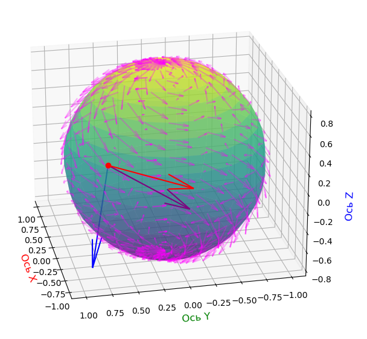

# Геометрия поверхности. Геодезические

## Желания:

## Вопросы:

И так, нужно разобраться с первой фундаментальной формой поверхности, "прощупать" её, попробовать реализовать что-то подобное.
Также застрял на вопросе с касательной плоскостью, нормалью, как их определять и т.д.

1. Что такое билинейная форма? Что такое симметрическая положительно определенная билинейная форма?

21.06.2026: пока это не нужно.

## Конспект

12.07.2026

Изучаем поверхности.

$M$ — $n$-мерная поверхность в евклидовом пространстве $\mathbb{R}$

25.09.2026

Окей, есть поверхность, её параметризация, можно посчитать производные по параметрам (u, v, ...), составить из них базис, посчитать  матрицу первой фундаментальной формы

Что пока не понятно, и что нужно повторить:
0. Почему все касательные векторы к поверхности в точке задают именно n-мерную плоскость? В двумерном случае почему это, например, не какой-нибудь там конус или что-то такое, но не плоскость? Наверное, это связано с регулярностью и гладкостью поверхности, но хочу иметь четкое представление.

Ответ: Гладкость поверхности означает, что в маленькая окрестность точки является практически плоскостью, которая совпадает с касательной.
Также свойство того, что вектора $\frac{\partial r}{\partial u}$ и $\frac{\partial r}{\partial v}$ линейно независимы, гарантирует наличие касательной плоскости в каждой точке поверхности (но это к тому, что касательная плоскость не "схлопывается")

1. Как искать длину кривой? Как построить кривую на поверхности? Как отрисовывать касательный вектор к этой кривой?
2. Как задавать вектор в касательной плоскости. Как его раскладывать. Какую роль он вообще играет, зачем нужен?
3. Как считать угол между векторами в касательной плоскости?
4. Как считать угол между касательным вектором и кривой на поверхности (который равен углу между этим вектором и касательным вектором)?
5. Как считать ковариантную производную? В чём смысл слова "ковариантный"? Почему не "инвариантный"? Какие есть виды ковариантной производной? (там есть что-то по i, и по направляющему вектору), в чём их смысл и как они связаны? 
6. Как выполнить параллелльный перенос касательного вектора вдоль кривой?
7. Как расчитывать геодезические? И вообще, вспомнить свойства
8. Что такое экспоненциальное отображение, как оно связано с геодезическими, как с ним работать?
9. Как всё это собрать воедино и начать иммитировать движение в искривлённом пространстве?

-------------------

### Аналитическая формула для обратной матрицы: 

$$
A^{-1} = \frac{1}{\det A} \cdot C^T
$$

где:

* $\det A$ — определитель матрицы $A$
* $C^T$ — транспонированная матрица алгебраических дополнений $C_{ij} = (-1)^{i+j} M_{ij}$, где $M_{ij}$ — миноры элементов $a_{ij}$

Таким образом, каждый элемент обратной матрицы вычисляется по аналитическому правилу:
$$
(A^{-1})_{ij} = \frac{C_{ji}}{\det A}
$$ 

Для матрицы размера $2×2$:

Если $A = \begin{pmatrix} a & b \\ c & d \end{pmatrix}$, то $A^{-1} = \frac{1}{ad - bc} \begin{pmatrix} d & -b \\ -c & a \end{pmatrix}$

Отдельно, конечно, хотелось бы разобраться на фундаментальном уровне с матрицами, их произведениями, оперделителями, собственными числами, веткорами, с наглядными картинками и геометрическим и физическим смыслом...

-------------------

Факт: не важен порядок, по которому производится частное дифференцирование функции, то есть, $\frac{\partial r}{\partial u \partial v} = \frac{\partial r}{\partial v \partial u}$. TODO: изучить, почему/вывести

Факт: Скалярное произведение векторов $\vec{a}$ и $\vec{b}$ равно скалярному произведению вектора $\vec{a}$ и проекции вектора $\vec{b}$ на вектор $\vec{a}$ (и наоборот). TODO: это просто следует из определения? Или есть какой-то более глубокий смысл?

-------------------

Расчёт символов Кристоффеля 2-го рода можно упростить (хз, есть ли такая формула, и как она называется, вроде, не ошибся):

Сами символы, в общем случае, рассчитываются по следующией формуле:

$$
\Gamma^k_{ij} = \frac{1}{2} \sum_{m=1}^n g^{km} \left(
     \frac{\partial g_{im}}{\partial u_j} + \frac{\partial g_{jm}}{\partial u_i} - \frac{\partial g_{ij}}{\partial u_m}
\right)
$$

где $g_{ij}$ — элементы матрицы первой фундаментальной формы, $g^{km}$ — элементы обратной матрицы.

При этом, 

$$
\frac{\partial g_{ij}}{\partial u_m} = \frac{\partial <r_i, r_j>}{\partial u_m} \overset{\text{по правилу Лейбница}}{=} \left< \frac{\partial r_i}{\partial u_m}, r_j \right> + \left< r_i, \frac{\partial r_j}{\partial u_m} \right> = \left< r_{im}, r_j \right> + \left< r_i, r_{jm} \right>
$$

Тогда сделав такую замену для каждого слагаемого в исходном выражении символа Кристоффеля, получим:

$$
\Gamma^k_{ij} = \sum_{m=1}^n g^{km} \left< r_{ij}, r_{m} \right>
$$

Для двумерного случая (точнее, двумерных координат $u$ и $v$) получим:

$$
\Gamma^k_{ij} = g^{ku} \left< r_{ij}, r_{u} \right> + g^{kv} \left< r_{ij}, r_{v} \right>
$$

TODO: разобраться в физическом и геометрическом смысле

TODO: откуда в символе Кристоффеля 2-го рода берутся элементы обратной матрицы, и почему они вообще там есть? В чём их физический и геометрический смысл?

-------------------

### Производная вдоль вектора

Изначально, наверное, задача стояла так:

Зная функцию $f(x)$, хотим знать, как её можно линейно приблизить в окрестности точки, то есть, какой примой мы можем воспользоваться, чтобы узнать примерное (очень близкое, хоть и не на 100% точное) значение функции при небольшом изменении аргумента? 

Линейная функция — самая простая, поэтому ей и удобно приближать.

То есть, хотим получить следующее приближение:

$$
f(x + \Delta x) \approx k(x + \Delta x) + b = kx + k \Delta x + b
$$

При этом, поскольку мы считаем $f(x)$ линией в окрестности точки $x$ (и в самой этой точке) и знаем значение $f$ в точке $x$, то $kx+b = f(x)$.

Тогда нам остаётся найти коэффициент $k$. Переносим всё, кроме $k$ в левую часть, получаем:

$$
k = \frac{f(x+\Delta x) - f(x)}{\Delta x}
$$

Это и есть исходная формула для расчёта производной. Теперь устремляем $\Delta x$ к нулю, получаем предельное и наиболее точное значение $k$, который и является коэффициентом наклона апроксимирующей прямой.

*Примечание*: для более "сильного", точного приближения/апроксимации используют функцию не 1-го порядка (линию), а 2-го, для ещё более точного — 3-го, и т.д.   
Так и возникает ряд Тейлора — разложение функции в ряд функций $1, 2, \dots, \infty$ порядков.

Теперь переходим к многомерному случаю:

TODO: 
1. Частные производные
2. Производные по направлению (вдоль вектора)
3. Полный дифференциал
4. Градиент, его геометрический смысл и связь с дифференциалом
5. Ковариантная производная

TODO: Желательно, конечно, разобраться с оператором набла, роторами, дивергенцией, оператором Лапласа

Обычная производная (одномерная) отвечает на вопрос, какой линейной функцией мы можем апроксимировать исходную функцию при небольшом изменении аргумента в окрестности некоторой точки. Точнее, она даёт на выходе коэффициент — скорость изменения 

В случае многомерного аргумента мы можем как выполнять аналогичную операцию — смотреть, как примерно линейно будет меняться функция при изменении одной из компонент аргумента (частные производные), так и выполнять обобщённую операцию — дифференцирование вдоль вектора.   Такая операция показывает, как примерно изменяется функция, если аргумент немного меняется вдоль такого-то направления.

Полный дифференциал — это коэффициенты касательной плоскости (аналог коэффициента касательной прямой), а градиент — это вектор, противоположный тому направлению, куда стекала бы вода, если бы она была на плоскости. Длина этого вектора — скорость скатывания (?).

Пусть $\vec{g} = \nabla f$ — градиент, а $\vec{a} = d\vec{r}$ — шаг. Тогда изменение функции $df$ равно длине градиента, умноженной на проекцию шага на направление градиента.

От ИИ:

Аналогия с одномерным случаем:

В одномерном случае у нас есть всего одно число — производная ($f'(x)$). Она совмещает в себе сразу две роли: 
1. Коэффициент наклона: Это число, на которое нужно умножить маленький шаг $dx$, чтобы получить линейное приращение функции ($df = f'(x)dx$). 
2. Скорость и направление изменения: Само значение $f'(x)$ показывает, насколько быстро растет функция. А его знак ($\pm $) указывает направление (вправо или влево по оси $X$). 

В многомерном пространстве (например, на плоскости $XY$) направлений становится бесконечно много. Поэтому одна производная больше не может выполнять обе роли. Происходит «разделение обязанностей»: 
1. Полный дифференциал ($df$) забирает себе роль коэффициента наклона (линейной аппроксимации). Это функция, которая принимает любой вектор смещения $(dx, dy)$ и выдает прогноз: «вот на столько изменится высота нашей горы». 
2. Градиент ($\nabla f$) забирает себе роль скорости и направления. Это конкретный вектор, который стрелкой указывает в сторону самого крутого подъема, а его длина показывает скорость этого подъема.

29.09.2026:

Что сейчас не понятно:

1. Как вообще задать касательный вектор к поверхности? Окей, допустим, есть поверхность, знаем её параметрические уравнения, и задана точка $u_0$. Как в этом месте задать какой-нибудь касательный вектор? Пример. Как понять, является ли произвольный вектор касательным? Как его разложить на базисные вектора в точке?
2. Как задается касательное векторное поле? Как его можно задать параметрически? Как сделать так, чтобы каждой его вектор был касательным, и как это проверить? И вообще, можно ли это сделать или это просто вспомогательная конструкция?
3. Правильно ли я понимаю суть ковариантной производной? Допустим, рассматриваем векторное поле в какой-то точке, оно дает нам некоторый касательный вектор. Смотрим, как будет меняться этот вектор при небольшом движении поля по направлению некоторого вектора. Поле будет меняться, вектор поворачиваться/наклоняться, вектор скорости изменения (то есть, разница между вектором в точке и вектором в точке при небольшом смещении), в общем случае, будет лежать вне касательной плоскости, и мы его просто проецируем на касательную плоскость? Зачем нам вообще это нужно?

Если у нас 

______

Как в лекциях вводятся геодезические (TODO: расписать подробнее):

Хотим определить аналог прямых на искривлённых поверхностях. Одно из свойств прямых в Евклидовом пространстве — их геометрическая прямота, отсутствие изгибов. На искривлённых поверхностях такую фигуру построить нельзя, поэтому пользуемся другим важным свойством: если точка двигается по прямой равномерно, то на неё не действует никакое ускорение.

Если рассмотреть какую-либо кривую на поверхности, то её вектор ускорения (с точки зрения объемлющего) никогда не равен нулю — всегда есть ускорения, выталкивающие точку из касательной плоскости, в которой она находится (конечно, можно описать такую поверхность, в которой в некоторой области вектор ускорения будет нулевым, но тогда, наверное, нарушится какое-то свойство, которым мы определяли искривлённые поверхности — регулярность или что-то такое, хз).

Поэтому для аналога прямых на поверхностях будем пользоваться уточнённым свойством — такие кривые будут иметь касательную компоненту вектора ускорения равную нулю. Полный вектор ускорения всегда можно разложить на нормальную и касательную составляющую, и геодезическими называются такие кривые, у которых при заданной параметризации в каждой её точке касательная составляющая вектора ускорения (то есть, проекция вектора ускорения на касательную плоскость) равна нулю.

При этом, ещё раз, смысл нормальной и касательной компоненты вектора ускорения: 
- Нормальная составляющая выталкивает точку из касательной плоскости (чем больше нормальный вектор, тем сильнее выталкивание, геометрически — сильнее изгиб поверхности)
- Касательная составляющая ускоряет точку вдоль касательной плоскости (причём, наверное, необязательно вдоль вектора движения, может выталкивать и в другую сторону, как, например, при круговом движении в плоскости)

**Определение.**
Кривая $\gamma$ на поверхности $M$ называется ***геодезической***, если $\Pi(\ddot{\gamma})=0$, то есть, если ортоганальная проекция вектора ускорения этой кривой на касательную плоскость в каждой точке этой кривой равна нулевому вектору.

____________

Для координатного расчёта геодезических (и не только) вводится аппарат ковариантного дифференцирования

**Определение.**
Гладкое векторное поле на $M$ — это соответствие, сопоставляющее каждой точке $P$ поверхности $M$ касательный вектор $\xi(P) \in T_P M$ в этой точке, гладко зависящий от $P$.

Для себя: геометрически гладкая зависимость в данном случае означает, что вектор "плавно", без разрывов, скачков переходит, "перетикает" при движении от точки к точке (в любом направлении).  

(На полюсах оно тоже гладкое, просто сводится в ноль. Тут как раз работает теорема о зачёсывании ежа)

То есть, $\xi(P)$ (или $\xi(u)$, если подставляем координаты) — эта такая функция, которая на вход принимает координаты $u$ точки $P$ и на выходе отдает некоторый касательный вектор к поверхности в этой точке (и этот вектор, по определению, лежит в касательной плоскости).

Тогда каждый такой вектор (то есть, каждое значение поле) мы можем разложить по каноническому базису:

$$
\xi(u) = \sum_{i=1}^n \xi_i(u)r_i(u)
$$

где $\xi_i(u)$ — координаты в каноническом базисе ($r_i(u)$) в данной точке.

Нам ничего не мешает продифференцировать это поле (функцию), однако результирующие векторы в общем случае не будут лежать в касательной плоскости, и нам нужно спроецировать их на плоскость.

Пример: сфера (фронтальная проекция), в точке на вершине касательный вектор направлен вправо, в следующей точке — вправо и вниз. Вектор скорости этого поля (то есть, вектор, характеризующий изменение векторов поля при движении от первой точки ко второй) будет лежать вне касательной плоскости первой точки  
TODO: нарисовать картинку

(Буду писать $\xi$, а не $\xi(u)$, так как работаем пока с одним и тем же полем)

**Определение.**
Ковариантная производная поля $\xi$  по переменной $u_j$ — это функция:

$$
\nabla_j\xi=\Pi\left(\frac{\partial \xi}{\partial u_i}\right)
$$

То есть, это ортоганальная проекция частной производной векторного поля $\xi(u)$ по переменной $u_i$

Такое определение зависит от параметризации (не очень понял, что это значит, точнее, понятен смысл — при замене координат координатное выражение изменится, но нужен пример для наглядности), поэтому определяется более инвариантная сущность — аналог производной вдоль вектора.

В математическом анализе производная функции нескольких переменных вдоль вектора считается через ограничение этой функции на прямую, проходящую через заданную точку с заданным направляющим вектором, функция становится функцией одной переменной, и считаем производную этой функции в заданной точке (то есть, у нас есть многомерный аргумент, и мы решаем, что будем двигаться только в одном направлении, то есть, вдоль одной прямой в этом многомерном пространстве (через заданную точку по заданному направлению (вектору) проходит только одна прямая). Соответственно, если мы движемся по какой-то фиксированной прямой, то это движение можно описать одним параметром, поэтому функция и становится одномерной. То есть, это такой её срез/сруб, хз как назвать).  
TODO: геометрическая картинка

Для векторного поля на поверхности так сделать не получится, так как прямых на поверхности нет, и вместо этого движемся вдоль некоторой кривой. Но нам важна не сама кривая, а вектор её скорости (вдоль него и ищем ковариантную производную).

Итак, хотим определить ковариантную производную векторного поля $\xi$ вдоль $\eta$ (в точке $P$) так, чтобы в результате получился касательный вектор. Для этого рассматриваем некоторую кривую $\gamma(t)$, для которой $\eta$ — касательный вектор (по определению (или свойствам, не помню) касательных векторов такая кривая всегда есть).

21:41

Так, ещё раз, что непонятно в вопросе ковариантных производных:

Понятно, что такое касательное векторное поле, понятно, что такое поверхность, параметризация, касательный вектор, касательная плоскость, канонический базис

Что у нас происходит с векторным полем (точнее, с вектором, определяемым через векторное поле) при движении от точки к точке

Мы эту точку куда-то тянем - по направлению касательного вектора $\eta$. Точка движется, смещается, векторное поле тоже меняется, изменение - это $\Delta\xi = \xi(u_2)-\xi(u_1)$. При предельном переходе получаем производную $\xi$ вдоль вектора $\eta$. 

(А, в матанализе такая производная, собственно, и обозначается через оператор Набла: $\nabla_{\vec{e}} f(x^0) = \lim_{h \to 0} \frac{f(x^0 + h \cdot {\vec{e}}) - f(x^0)}{h}$)

Производная, в общем случае, не будет находиться в касательной плоскости, поэтому проецируем её на касательную плоскость.

Ещё раз, зачем нам это нужно? Одна задача — определить такие кривые, у которых эта проекция — нулевая, а в целом всё равно не понимаю.

_____________

Геодезические — это такие кривые, у которых $\Pi(\ddot{\gamma})=\nabla_{\dot{\gamma}}\dot{\gamma}=0$ (то есть, ковариантная производная касательного семейства (то есть, семейства векторов скорости этих кривых) вдоль этой кривой равна нулю).

______________

30.09

Для себя: если на поверхности есть точка и она просто стоит на месте, то никакого ускорения нет. Как только она начинает куда-то двигаться, как только появляется вектор скорости (который является касательным к поверхности в этой точке. Направляющий вектор и вектор скорости — это одно и то же), сразу же появляется и вектор ускорения — просто из-за того, что поверхность кривая, и траектория, по которой будет двигаться точка, тоже кривая. Просто чисто геометрически — если есть искривление, то есть и ускорение (единственная кривая, где возможно полностью прямолинейное движение, без какого-либо ускорения — это прямая. Во всех остальных случаях ускорение и определяет изгиб, это взаимосвязанные вещи). Сам вектор ускорения будет находиться вне касательной плоскости, но его можно разложить на нормальную и касательную составляющие. И касательная составляющая — это и есть ковариантная производная (её результат) вектора скорости в точке.

При этом, в лекциях доказывается, что неважно, к какой именно кривой относится вектор скорости (то есть, по какой кривой затем будет двигаться точка), важен лишь векто скорости в данной точке.

Вот тут не очень понимаю, что именно нам будет показывать касательная составляющая? В плоскости — понятно (точнее, там мы не разбиваем вектор ускорения): она показывает, в каком направлении "тянет" точку, и как будет изгибаться линия. Чем сильнее "натяжение", тем сильнее будет растягиваться или изгибаться линия.

Нормальное ускорение "прижимает" точку к поверхности, оно не даёт ей "соскачить" с неё в объемлющее пространство. То есть, это то, что удерживает точку на поверхности.

Касательное ускорение — это то, что характеризует "изворотливость" кривой уже в самом пространстве, отклонение от геодезической, идеальной кривой, у которой таких изворотов и ускорений нет — единственное, что действует на точку, движущейся по геодезической — ускорение, прижимающее её к поверхности.

**Утверждение.**
$\nabla_\eta\xi$ — это касательный вектор к поверхности $M$ в точке $P$, не зависящий от выбора кривой $\gamma$. Если $u$ — координаты на $M$ и $P=(u_1^0,\dots,u_n^0)$, то:

$$
\nabla_\eta\xi = \sum_{j=1}^n \eta_j \nabla_j \xi(u_0)
$$

где $\eta_j$ — координаты вектора $\eta$ в каноническом базисе (соответствующем координатам $u$), $u_0$ — точка, в которой ищется такая производная

Для себя: в чём смысл и суть выражения:  
У нас есть поверхность $M$, координаты $u$, точка $P$ с координатами $u^0=(u_1^0,\dots,u_n^0)$. Также на поверхности задано векторное поле $\xi(u)$, которое каждой точке поверхности сопоставляет некоторый касательный вектор. Также в данной точке задан некоторый касательный вектор $\eta$. 
Нам интересно, как будет меняться векторное поле $\xi$ в проекции на касательную плоскость, если мы будем двигаться вдоль этого вектора. То есть, с какой скоростью и куда будет меняться $\xi$.

Теперь разберём компоненты этого выражения (не совсем корректная интерпретация, ниже (02.10) указана правильная):
- $\nabla_j\xi(u^0)$ — показывает то, как будет меняться базисный вектор $r_j$ (в проекции на $T_P M$) при применении к нему $\xi$ в точке $u^0$.
- У вектора $\eta$ есть координаты в базисе $r_1,\dots,r_n$, $\eta_j$ — $j$-я координата. Изменения линейны (то есть, $f(ax)=af(x)$), поэтому просто домножаем измененный вектор на его координаты.

Короче, это формула говорит:  "Базис $r_1,\dots,r_n$ под действием ковариантной производной меняется так-то. Соответственно, вектор $\eta$ с координатами $\eta_1,\dots,\eta_n$ в этом базисе поменяется так-то."
 
UPD: нет, такая интерпретация неверна. Базис у нас не зависит ни от какого поля, и поле (и его производная) не применяется к базису. $\nabla_j\xi(u^0)$ говорит о том, как будет меняться поле (в проекции на касательную плоскость) при движении по базисному вектору $r_j$, а $\nabla_\eta\xi(u^0)$ — то, как -//- при движении по вектору $\eta$ (который является линейной комбинацией векторов $r_j$). То есть, эти формулы показывают, как меняется поле, а не базис.

Если непонятно, то вот более простой случай (в целом, опишу, в чём суть дифференцирования векторного поля по направлению):  
Пусть работаем в евклидовом пространстве $\mathbb R^2$, каждая точка задана координатами $u$ и $v$. Пусть есть векторное поле $\xi(x)$ — оно сопоставляет каждой точке $x$ (её координатам $u^x, v^x$) некоторый вектор, исходящий из этой точки.  
Пусть есть какая-то конкретная точка $x_0$, заданная координатами $(u^0, v^0)$. Из этой точки выходит некоторый вектор $\xi_0 = \xi(x_0)$. Пусть он смотрит на северо-восток (вправо и вверх). 
- Если мы движем точку вправо (не бесконечно мало, просто вручную двигаем слайдер), то, пусть, этот вектор начинает чуть-чуть поварачиваться по часовой стрелке и уменьшаться. 
- Если движем точку вверх, то, допустим, вектор начинает уменьшаться, но не поворачиваться.

Предельное изменение при движении вправо — это частная производная векторного поля по координате $u$ — то, с какой силой векторное поле будет разворачивать и уменьшать $\xi_0$.  
То есть, как и в обычных производных: 
$$
\xi(u_0 + \Delta u, v_0) \approx \xi(u_0, v_0) + \frac{\partial \xi}{\partial u}(u_0, v_0) \cdot \Delta u, \Delta u \to 0
$$

Аналогично и для движения вверх:

$$
\xi(u_0, v_0 + \Delta v) \approx \xi(u_0, v_0) + \frac{\partial \xi}{\partial u}(u_0, v_0) \cdot \Delta v, \Delta v \to 0
$$

$\frac{\partial \xi}{\partial u}$ и $\frac{\partial \xi}{\partial v}$ — это вектора, и мы домножаем их на небольшое смещение.

Но двигаться мы можем не только вправо и влево, но и в любом направлении. Тогда такое направление задаётся вектором $\vec{h} = (\Delta u, \Delta v)$, и при дифференцировании мы получаем информацию о том, какой вектор будет действовать на $\xi_0$, если точка будет двигаться в направлении $\vec{h}$. При этом, в мат. анализе длина такого вектора ограничивается на единицу. Наверное, если не ограничивать, то просто домножаем на коэффициенты.

TODO: понять, как связаны производная по направлению в евклидовых пространствах и на искривлённых поверхностях, и почему на поверхностях не говорят про ограничение длины вектора.

Тогда:

$$
\xi(u_0 + \Delta u, v_0 + \Delta v) \approx \xi(u_0, v_0) + \frac{\partial \xi}{\partial u}(u_0, v_0) \cdot \Delta u + \frac{\partial \xi}{\partial v}(u_0, v_0) \cdot \Delta u, \Delta v \to 0, \Delta v \to 0
$$

TODO: картинки

По сути, $\frac{\partial \xi}{\partial u}$ показывает, как меняется базисный вектор $\vec{e_u}$, а $\frac{\partial \xi}{\partial v}$ — то, как меняется $\vec{e_v}$

Здесь может возникнуть путанница: в случае поля мы работаем с двумя типами векторов — векторами самого пространства и векторами поля, и вторые зависят первых (значение $\xi$ зависит от координат $(u, v)$).   
То есть, векторное поле — это как бы "надстройка" над евклидовым пространством, это как отдельный слой, не влияющий на исходное пространство (так же, как, например, для скалярных функций значение функции не влияет на аргумент). И мы просто анализируем эту надстройку.

Для себя: интересно порассуждать над сутью, природой векторного поля — это объект, который как бы "двигает" базис? Или, скорее, передвигается от точки к точке, и сопоставляет каждой точке пространство вокруг неё, делая её центром этого пространства, и описывая вектор, который исходит из неё? Что-то в этом роде.  
Он не меняет исходное евклидово пространство, но каждой точке добавляет некоторую её характеристику, выраженную в векторном виде. В частности, например, это может быть нормаль к поверхности в данной точке.

В евклидовом пространстве базисные вектора в каждой точке — одни и те же, и равны базисным векторам в начальных координатах, поэтому работаем с базисными. А в случае искривлённых поверхностей, в каждой точке разные базисные вектора, и работаем уже с ними. Хотя и в Евклидовом случае, по сути, тоже работаем с базисными векторами относительно этой точки, но, опять же, они равны тем, что находятся в точке начала координат.

А кривые поверхности — это обобщение евклидовых пространств, тут уже базисы меняются, и нам приходится это учитывать.
____________

02.10

Всё, наконец понял для себя смысл выражения ковариантной производной.

Начнём снова по порядку. Буду рассматривать случай, когда отображаем двумерные координаты на трёхмерное пространство

Есть некоторая поверхность $M$, каждая точка которой задана координатными выражениями $x(u, v), y(u, v), z(u, v)$. То есть, задана параметризация $r=r(u, v)$.

В каждой точке поверхности есть касательная плоскость, и базисом в этой плоскости будут вектора $r_u, r_v$, где $r_u = \frac{\partial r}{\partial u}$, $r_v = \frac{\partial r}{\partial v}$. Их смысл — показывать куда будет "тянуть" точку поверхности при небольшом изменении $u$ и $v$ соответственно.

Любой вектор $\eta$ из этой плоскости можно разбить на сумму векторов $r_u$ и $r_v$ с некоторыми коэффициентами $\eta_u$ и $\eta_v$ соответственно. Эти коэффициенты — это и есть координаты вектора $\eta$ в данном базисе. (Базис, в общем случае, не ортонормированный).

Далее вводим касательное векторное поле — функцию, которая каждой точке поверхности $P$ (которая соответствует некоторым координатам $(u, v)$) сопоставляет касательный вектор $\xi(u, v)$ к поверхности в этой точке. Тогда, раз этот вектор касается поверхности, то его можно разложить по базисным векторам $r_u$ и $r_v$ в этой точке: 

$$
\xi(u, v) = \xi = \xi_u r_u + \xi_v r_v
$$. 

При этом, сами коэффициенты $\xi_u$ и $\xi_v$ — это тоже функции, которые гладко зависят от $u$ и $v$. 

Теперь нам интересно, как будет меняться векторное поле при небольшом изменении $u$. Это можно определить через частную производную:

$$
\frac{\partial \xi}{\partial u} = \frac{\partial}{\partial u} \xi = 
\frac{\partial}{\partial u} \xi_u(u,v) r_u + \frac{\partial}{\partial u} \xi_v(u,v) r_v \overset{\text{по правилу Лейбница}}{=}
\frac{\partial \xi_u(u,v)}{\partial u} r_u + \xi_u(u,v)\frac{\partial r_u}{\partial u} + \frac{\partial \xi_v(u,v)}{\partial u} r_v + \xi_v(u,v)\frac{\partial r_v}{\partial u} = 
\frac{\partial \xi_u(u,v)}{\partial u} r_u + \xi_u(u,v)r_{uu} + \frac{\partial \xi_v(u,v)}{\partial u} r_v + \xi_v(u,v) r_{vu}
$$

Фактически, эта формула нам говорит: Вы собираетесь двигаться вправо? Тогда полное изменение поля будет вот таким.

Аналогично, для небольшого изменения координаты $v$:

$$
\frac{\partial \xi}{\partial v} =
\frac{\partial \xi_u(u,v)}{\partial v} r_u + \xi_u(u,v)r_{uv} + \frac{\partial \xi_v(u,v)}{\partial v} r_v + \xi_v(u,v) r_{vv}
$$

То есть, изменение координаты $u$ и движение вдоль вектора $r_u$ — это, фактически, одно и то же, разные сущности, описывающие один и тот же процесс. Изменение координаты $u$ взаимнооднозначно соответствует движению вдоль вектора $r_u$. Аналогично и для координаты $v$ и вектора $r_v$.

Тогда если будем двигаться вдоль вектора $\eta = \eta_u r_u + \eta_v r_v$, изменение поля вдоль этого направления будет суперпозицией, суммой изменений вдоль $r_u$ и $r_v$ (следует из линейности дифференцирования).

Такая функция обозначается как $\partial_\eta \xi$. Но нас интересует именно касательная часть этой функции, $\Pi(\partial_\eta \xi) = \nabla_\eta\xi$, которая и называется ковариантной производной. 

Теперь связь с символами Кристоффеля:

В выражениях, полученных выше есть вектора $r_{uu}, r_{uv}, r_{vu}, r_{vv}$ — это вторые частные производные поверхности (или как это правильно сформулировать, короче, вектора $r$ объёмлющего пространства), и они показывают, как будет меняться сам базис (базисные вектора). Сам базис будет крутиться, растягиваться, поворачиваться. Соответственно, всё это же будет происходить и с любыми векторами, разложенными по этому базису (то есть, из касательной плоскости). 

И проекция $r_{uu}, r_{uv}, r_{vu}, r_{vv}$ на касательную плоскость как раз и будут говорить о том, что с ней происходит, причём именно изнутри. "Внутренние" действия — это растяжения, повороты базисных векторов, внешние — это наклон плоскости. Интересно, кстати, есть такое действие как "разворот" плоскости (вокруг какой-то оси/точки), и к какому из типов действий он относится — внутренним или внешним.

Так, опять задаюсь вопросом, а зачем нам вообще что-то проецировать на касательную плоскость? Почему не можем работать с векторами в объемлющем пространстве?  
Нужно где-то себе нормально объяснить, зачем это делаем, а то задаюсь и впадаю в нудные рассуждения и непонимание...

И нам как раз и нужно определить, как спроецировать эти векторы, и для этого и нужны символы Кристоффеля.

Если мы их спроецировали, то у них будут свои коэффициенты разложения по базису этой плоскости, и это как раз и будут символы Кристоффеля:

$$
\Pi (r_{uu})=\Gamma_{uu}^{u}r_{u}+\Gamma_{uu}^{v}r_{v}
$$

$$
\Pi (r_{uv})=\Gamma_{uv}^{u}r_{u}+\Gamma_{uv}^{v}r_{v}
$$

$$
\Pi (r_{vu})=\Gamma_{vu}^{u}r_{u}+\Gamma_{vu}^{v}r_{v}
$$

$$
\Pi (r_{uv})=\Gamma_{vv}^{u}r_{u}+\Gamma_{vv}^{v}r_{v}
$$

Причём в такой записи сразу можно понять, к чему относятся коэффициенты $i,j,k$ в каждом из коэффициентов $\Gamma_{ij}^k$: $i, j$ — коэффициенты производной, $k$ — номер базисного вектора, к которому относится коэффициент.

TODO: ещё раз разобрать вывод символов Кристоффеля и координатную запись ковариантных производных. Вроде, там всё понятно, но хорошо бы закрепить и перенести сюда

В итоге, получаем:

$$
\nabla_j \xi = \sum_{i=1}^n \left( \frac{\partial \xi_i}{\partial u_j} + \sum_{k=1}^n \Gamma_{jk}^i \xi_k \right) r_i
$$

$$
\nabla_\eta \xi = \sum_{j=1}^n \eta_j \nabla_j\xi = \sum_{i,j=1}^n \eta_j \left( \frac{\partial \xi_i}{\partial u_j} + \sum_{k=1}^n \Gamma_{jk}^i \xi_k \right) r_i
$$

TODO: переписать для двумерных координат

_________________

### Параллельный перенос касательных векторов

Пусть есть поверхность $M$ и на ней есть точки $P$ и $Q$. Пусть $\xi_0$ — касательный вектор к $M$ в $P$, $\xi_0 \in T_P M$.

Мы хотим выполнить параллельный перенос этого вектора в точку $Q$. Мы не можем сделать это "напрямую", так же, как это делается в $\mathbb{R}^N$ (отрисовать от $Q$ такой же вектор) — в таком случае перенесённый вектор перестанет касаться поверхности (и в касательной плоскости (в $P$ и $Q$ разные касательные плоскости)). То есть, наша версия параллельного переноса должна переводить касательный вектор снова в касательный.

TODO: рисунки

Для решения этой задачи можем выполнять перенос не сразу, а постепенно, вдоль некоторой гладкой кривой, соединяющей эти точки.

##### Как такой процесс будет работать в $\mathbb{R}^N$:

TODO: рисунок

$t \in [0; T]$

$\xi(0) = \xi(T) = \xi(t) = \xi_0 = const$, соответственно, $\frac{d\xi}{dt} = 0$.

Получаем гладкое семейство векторов, которое задано в каждой точке кривой, и все элементы этого семейства — одинаковые.

##### Как такой процесс будет работать на поверхности:

TODO: рисунок

Переносим вектор вдоль гладкой кривой на поверхности. Тоже получаем гладкое семейство векторов, полученное нашей "версией" параллельного переноса $\xi_0$ вдоль этой кривой.

В нашем случае "одинаковость" векторов будет заключаться в том, что ковариантная производная этого семейства будет равна 0 в каждой точке кривой.

Итак, пусть $M$ — поверхность, $\gamma$ — гладкая кривая на $M$. Уравнение этой кривой в координатах $u$: $u_j=u_j(t), t \in [0, T]$.

Будем рассматривать семейство касательных векторов, определенных в точках этой кривой.
Это, по сути, векторное поле, но ограниченное

То есть, в каждой касательной плоскости, которая возникает при параллельном переносе не должно быть никаких разворотов и растяжений. А то, что касательная плоскость (и, следовательно, переносимый вектор) как-то там наклоняются, это уже не касается того, что происходит внутри самой плоскости, то есть, на внутренней геометрии.